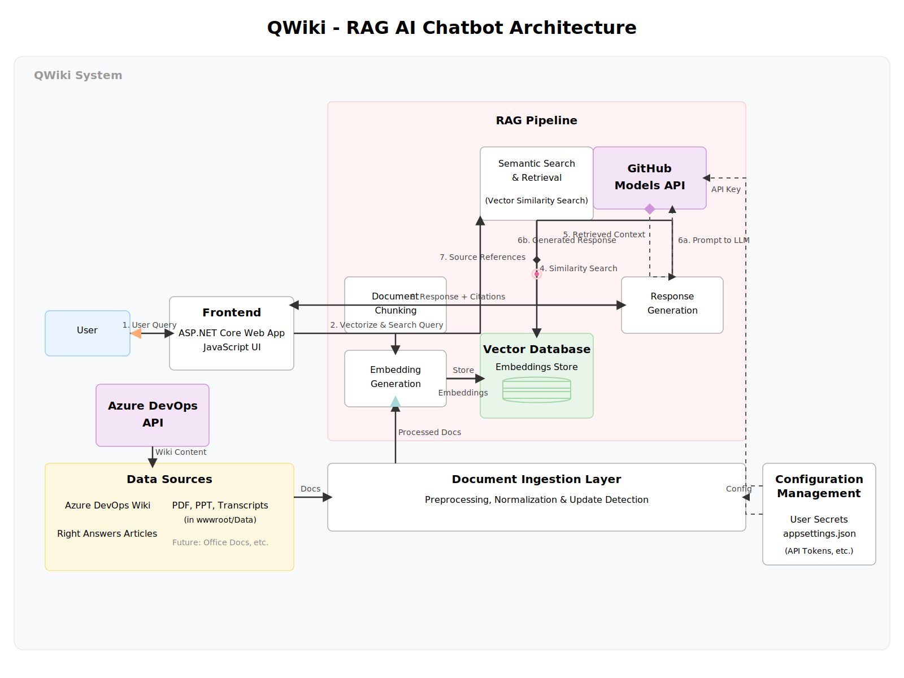

# QWiki - RAG-Based AI Documentation Assistant

QWiki is a **Retrieval Augmented Generation (RAG)** based AI Assistant designed to answer documentation-related queries from developers and provide relevant wiki or knowledge base articles as references for further exploration.

## What is QWiki?

QWiki builds upon the concept of creating an intelligent documentation assistant that can:

- **Answer Process-Related Queries**: Help developers find information about internal processes, procedures, and best practices
- **Reference Documentation**: Provide relevant wiki articles and knowledge base entries as supporting references
- **Support Multiple Document Types**: Process PDFs, Word documents, PowerPoint presentations, and wiki content
- **Enable Knowledge Discovery**: Allow users to explore documentation through natural language queries

## Architecture Overview



QWiki follows a modern **Retrieval Augmented Generation (RAG)** architecture that combines intelligent document retrieval with AI-powered response generation:

### Core Components:
- **Frontend**: ASP.NET Core web application with JavaScript UI for user interactions
- **Document Ingestion Layer**: Processes multiple document types (Azure DevOps wikis, PDFs, PPTs, transcripts) and converts them into searchable vector embeddings
- **Vector Database**: Stores document embeddings for fast semantic similarity search
- **RAG Pipeline**: Orchestrates the flow from user query → document retrieval → AI response generation
- **GitHub Models API**: Provides AI capabilities for embedding generation and response creation

### Data Flow:
1. **User Query**: Natural language questions entered through the web interface
2. **Vectorize & Search**: Query is converted to embeddings and searched against the vector database
3. **Context Retrieval**: Most relevant document chunks are retrieved based on semantic similarity
4. **Response Generation**: GitHub Models API generates responses using the retrieved context
5. **Source Citations**: Responses include references to original documents for verification

This architecture ensures accurate, contextual responses while maintaining transparency through source tracking and enables easy extension to support additional document types and data sources.

## Key Features

- **RAG Architecture**: Uses Retrieval Augmented Generation to combine document search with AI-generated responses
- **Multi-Source Ingestion**: Supports PDF files, Azure DevOps wiki pages, and can be extended for other document types
- **Semantic Search**: Uses vector embeddings to find relevant content based on meaning, not just keywords
- **Reference Tracking**: Provides source citations and page numbers for verification and further reading
- **Real-time Updates**: Automatically detects and processes new or modified documents

## Future Extensions

The application is designed to be extensible and can support:

- **Office Documents**: PowerPoint presentations and Word documents for product documentation
- **Meeting Transcripts**: Processing brownbag session transcripts and meeting notes
- **Custom Data Sources**: Any structured or unstructured documentation sources

>[!NOTE]
> Before running this project you need to configure the API keys or endpoints for the providers you have chosen. See below for details specific to your choices.

# Configuration

## Prerequisites

QWiki requires two types of tokens depending on your data sources:

1. **GitHub Models Token** - For AI model access (required)
2. **Azure DevOps PAT Token** - For wiki ingestion (optional, only if using Azure DevOps wikis)

## 1. GitHub Models Token Setup

GitHub Models provides free access to AI models for prototyping and development.

### Steps to Get Your GitHub Models Token:

1. **Sign in to GitHub**: Go to [GitHub.com](https://github.com) and sign in to your account
2. **Navigate to Settings**: Click on your profile picture → Settings
3. **Access Developer Settings**: Scroll down and click "Developer settings" in the left sidebar
4. **Personal Access Tokens**: Click "Personal access tokens" → "Tokens (classic)"
5. **Generate New Token**: Click "Generate new token" → "Generate new token (classic)"
6. **Configure Token**:
   - **Note**: Enter a descriptive name like "QWiki GitHub Models Access"
   - **Expiration**: Choose your preferred expiration (recommend 90 days for development)
   - **Scopes**: **IMPORTANT - Leave all scopes unchecked** (no permissions needed)
7. **Generate Token**: Click "Generate token"
8. **Copy Token**: Copy the token immediately (you won't be able to see it again)

### Configure GitHub Models Token:

```bash
cd QWiki
dotnet user-secrets set "GitHubModels:Token" "your-github-token-here"
```

## 2. Azure DevOps PAT Token Setup (Optional)

Only needed if you want to ingest content from Azure DevOps wikis.

### Steps to Get Your Azure DevOps PAT Token:

1. **Sign in to Azure DevOps**: Go to your Azure DevOps organization (e.g., `https://dev.azure.com/yourorg`)
2. **Access User Settings**: Click on your profile picture → "Personal access tokens"
3. **Create New Token**: Click "New Token"
4. **Configure Token**:
   - **Name**: Enter "QWiki Wiki Access" or similar
   - **Organization**: Select your organization or "All accessible organizations"
   - **Expiration**: Choose your preferred expiration
   - **Scopes**: Select "Custom defined" and check:
     - **Wiki**: Read
     - **Project and Team**: Read (if needed for project access)
5. **Create Token**: Click "Create"
6. **Copy Token**: Copy the token immediately

### Configure Azure DevOps PAT Token:

```bash
cd QWiki
dotnet user-secrets set "AzureDevOps:Pat" "your-azure-devops-pat-here"
```

## Alternative Configuration Methods

### Using Visual Studio:
1. Right-click on the QWiki project in Solution Explorer
2. Select "Manage User Secrets"
3. Add your tokens to the `secrets.json` file:

```json
{
   "GitHubModels:Token": "your-github-token-here",
   "AzureDevOps:Pat": "your-azure-devops-pat-here"
}
```

### Using appsettings.Development.json (Not Recommended):
For testing only - **never commit tokens to source control**:

```json
{
   "GitHubModels:Token": "YOUR-TOKEN",
   "AzureDevOps:Pat": "YOUR-TOKEN"
}
```

## Running the Application

1. **Configure Tokens** (see above)
2. **Add Documents**: Place PDF files in the `wwwroot/Data` directory
3. **Build and Run**:
   ```bash
   cd QWiki
   dotnet build
   dotnet run
   ```
4. **Access the Application**: Open your browser to `http://localhost:5100`

## Glossary

### **RAG (Retrieval Augmented Generation)**
A machine learning approach that combines information retrieval with text generation. Instead of relying solely on the AI model's training data, RAG first retrieves relevant documents from a knowledge base, then uses that context to generate more accurate and factual responses. This reduces hallucinations and provides verifiable information sources.

### **Semantic Search**
A search technique that understands the meaning and context of queries rather than just matching keywords. Unlike traditional keyword-based search, semantic search can find relevant documents even when they don't contain the exact words from the query. For example, searching for "database performance" could return documents about "SQL optimization" or "query tuning."

### **Embeddings**
Mathematical representations of text, documents, or other data as vectors (arrays of numbers) in high-dimensional space. Words or documents with similar meanings are positioned close to each other in this vector space. Embeddings capture semantic relationships - for instance, "king" and "queen" would have similar embeddings because they're both royal titles.

### **Vector Database**
A specialized database designed to store, index, and search vector embeddings efficiently. Vector databases use algorithms like cosine similarity or Euclidean distance to find the most similar vectors to a given query vector. This enables fast semantic search across large document collections.

### **Document Chunking**
The process of breaking down large documents into smaller, manageable pieces (chunks) before converting them to embeddings. This is necessary because:
- AI models have token limits for input size
- Smaller chunks provide more precise retrieval results
- Better granularity for source citations and references

### **Vector Similarity Search**
The process of finding the most similar vectors in a vector database to a query vector. Common similarity measures include:
- **Cosine Similarity**: Measures the angle between vectors (most common for text)
- **Euclidean Distance**: Measures straight-line distance between vectors
- **Dot Product**: Measures vector alignment and magnitude

### **Document Ingestion**
The automated process of:
1. Discovering and reading documents from various sources
2. Extracting text content and metadata
3. Preprocessing and normalizing the content
4. Converting text into vector embeddings
5. Storing embeddings in the vector database for search

### **Source Citations**
References to the original documents where information was found, including:
- Document name and type
- Page numbers or section references
- Confidence scores for retrieval accuracy
- Direct links to source materials when available

### **Context Window**
The maximum amount of text (measured in tokens) that an AI model can process at once. In RAG systems, this limits how much retrieved context can be included with the user's query when generating responses. Effective chunking and retrieval strategies help maximize the use of available context space.

### **Personal Access Token (PAT)**
A security token used for authenticating with APIs without using passwords. PATs provide:
- Fine-grained permissions control
- Easier credential management
- Ability to revoke access without changing passwords
- Audit trails for API usage

## Learn More

- [GitHub Models Documentation](https://docs.github.com/github-models/prototyping-with-ai-models)
- [Azure DevOps Personal Access Tokens](https://docs.microsoft.com/en-us/azure/devops/organizations/accounts/use-personal-access-tokens-to-authenticate)
- [.NET User Secrets](https://docs.microsoft.com/en-us/aspnet/core/security/app-secrets)
