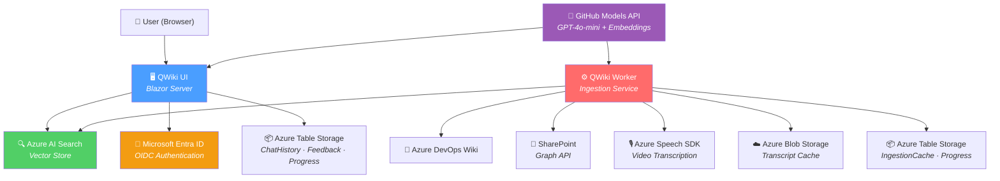
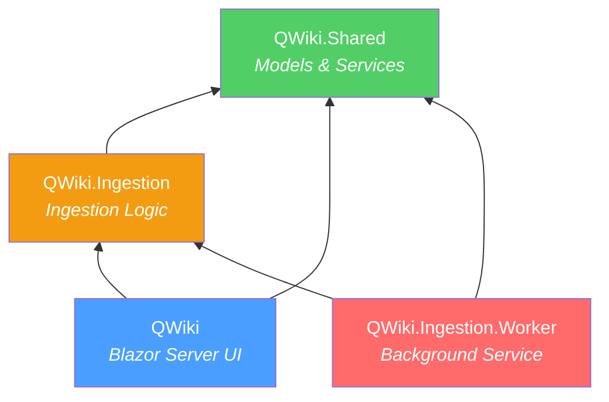
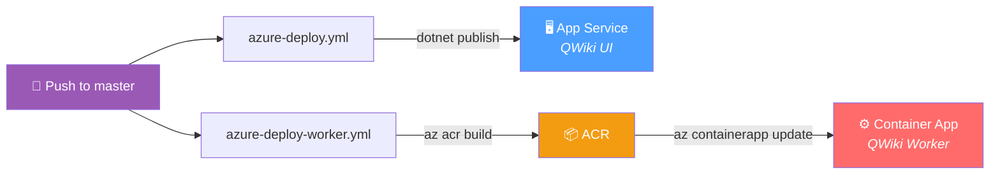

# QWiki - RAG-Based AI Documentation Assistant

QWiki is a **Retrieval Augmented Generation (RAG)** based AI Assistant designed to answer documentation-related queries from developers and provide relevant wiki or knowledge base articles as references for further exploration.

## What is QWiki?

QWiki builds upon the concept of creating an intelligent documentation assistant that can:

- **Answer Process-Related Queries**: Help developers find information about internal processes, procedures, and best practices
- **Reference Documentation**: Provide relevant wiki articles and knowledge base entries as supporting references
- **Support Multiple Document Types**: Process PDFs, Word documents, PowerPoint presentations, wiki content, and video recordings (MP4/MKV via speech-to-text transcription)
- **Enable Knowledge Discovery**: Allow users to explore documentation through natural language queries
- **Per-User Chat History**: Conversations are persisted and isolated per authenticated user
- **Admin Dashboard**: Content management page with ingestion progress tracking, document inventory, and feedback overview

## Architecture Overview

QWiki follows a modern **Retrieval Augmented Generation (RAG)** architecture with decoupled ingestion and UI layers:


```mermaid
graph TD
    User["👤 User (Browser)"] --> UI["🖥️ QWiki UI<br/><i>Blazor Server</i>"]
    UI --> Search["🔍 Azure AI Search<br/><i>Vector Store</i>"]
    Worker["⚙️ QWiki Worker<br/><i>Ingestion Service</i>"] --> Search

    UI --> Auth["🔐 Microsoft Entra ID<br/><i>OIDC Authentication</i>"]
    UI --> TableUI["📦 Azure Table Storage<br/><i>ChatHistory · Feedback · Progress</i>"]

    GitHub["🤖 GitHub Models API<br/><i>GPT-4o-mini + Embeddings</i>"] --> UI
    GitHub --> Worker

    Worker --> Wiki["📖 Azure DevOps Wiki"]
    Worker --> SP["📁 SharePoint<br/><i>Graph API</i>"]
    Worker --> Speech["🎙️ Azure Speech SDK<br/><i>Video Transcription</i>"]
    Worker --> Blob["☁️ Azure Blob Storage<br/><i>Transcript Cache</i>"]
    Worker --> TableW["📦 Azure Table Storage<br/><i>IngestionCache · Progress</i>"]

    style UI fill:#4a9eff,color:#fff
    style Worker fill:#ff6b6b,color:#fff
    style Search fill:#51cf66,color:#fff
    style GitHub fill:#9b59b6,color:#fff
    style Auth fill:#f39c12,color:#fff
```

### Key Design Decisions

- **Decoupled Ingestion**: The Worker Service handles all document ingestion independently from the UI. This allows scaling ingestion separately from the UI.
- **Shared Embedding Model**: Both UI and Worker use `text-embedding-3-small` (1536 dimensions) via `QWiki.Shared.EmbeddingConfig` to ensure vector compatibility.
- **Microsoft Entra ID Authentication**: All users must sign in via OpenID Connect. The admin page is restricted to a specific Entra Object ID.
- **Per-User Data Isolation**: Chat history is partitioned by Entra Object ID in Azure Table Storage.
- **Dev-Mode Toggle**: For local development, set `RunIngestionInProcess: true` to run everything in a single process.

### Data Flow

1. **Document Discovery**: Worker discovers documents from Wiki and SharePoint
2. **Content Extraction**: Text extracted from PDFs (PdfPig), Office docs (OpenXml), and wiki pages (REST API)
3. **Video Transcription**: For MP4/MKV files, audio is extracted via FFmpeg, transcribed using Azure Speech SDK (continuous recognition), and cached in Azure Blob Storage. Transcripts are chunked with `[HH:MM:SS]` timestamp labels.
4. **Chunking & Embedding**: Content chunked (~300 words with 50-word overlap) and embedded via text-embedding-3-small
5. **Vector Storage**: Embeddings stored in Azure AI Search with metadata (filename, page number, record type, source URL)
6. **User Query**: Natural language questions entered through the Blazor chat UI
7. **Dual-Query Search**: Two parallel searches run against Azure AI Search — one excluding video transcripts, one including all sources. Results are merged to ensure wiki/document results always appear alongside video results.
8. **Response Generation**: GPT-4o-mini generates responses with citations and source links

### Data Sources

| Source | Document Types | Status |
|--------|---------------|--------|
| Azure DevOps Wiki | Wiki pages (Markdown) | Active |
| SharePoint | PDF, PPTX, DOCX | Active |
| SharePoint | MP4, MKV (video transcription) | Active |

### Supported File Types

| Format | Extraction | Record Type | Features |
|--------|-----------|-------------|----------|
| PDF | PdfPig (page-by-page) | PDF | Page number citations |
| PPTX | OpenXml (slide-by-slide) | PPTX | Slide number citations |
| DOCX | OpenXml (paragraphs) | DOCX | Text chunk citations |
| Wiki | Azure DevOps REST API | WIKI | Direct wiki page links |
| MP4/MKV | Azure Speech SDK (transcription) | VIDEO | Timestamp citations (`[HH:MM:SS]`) |

## Solution Structure

```
QWiki.sln
|
+-- QWiki.Shared/                        Shared models & services (leaf dependency)
|   +-- SemanticSearchRecord.cs          Vector record model
|   +-- EmbeddingConfig.cs               Embedding model constants (single source of truth)
|   +-- ChatHistoryService.cs            Per-user chat history (Azure Table Storage)
|   +-- FeedbackService.cs               User feedback collection (Azure Table Storage)
|
+-- QWiki.Ingestion/                     Class library (all ingestion logic)
|   +-- IIngestionSource.cs              Interface for ingestion sources
|   +-- DataIngestor.cs                  Orchestrator: discovery -> extraction -> embedding -> storage
|   +-- AzureTableIngestionCache.cs      Persistent cache (Azure Table Storage)
|   +-- ContentExtractor.cs              PDF, PPTX, DOCX text extraction + chunking
|   +-- AudioTranscriber.cs              Video transcription (Azure Speech SDK + FFmpeg + Blob cache)
|   +-- IngestionProgressService.cs      Live progress tracking (shared with admin UI via Azure Table)
|   +-- IngestionServiceExtensions.cs    DI registration + RunIngestionAsync helper
|   +-- Sources/
|       +-- WikiIngestionSource.cs       Azure DevOps Wiki ingestion
|       +-- SharePointIngestionSource.cs SharePoint Graph API ingestion (docs + videos)
|
+-- QWiki.Ingestion.Worker/             Worker Service (standalone ingestion host)
|   +-- Program.cs                       Host builder + DI setup
|   +-- IngestionWorker.cs               BackgroundService with interval/RunOnce config
|   +-- appsettings.json                 Worker-specific configuration
|
+-- QWiki/                               Blazor Server UI
    +-- Program.cs                       Web app + auth + optional dev-mode ingestion
    +-- Services/SemanticSearch.cs        Hybrid search against Azure AI Search
    +-- Components/
    |   +-- Pages/Chat/                  Chat UI (Chat, ChatInput, ChatMessageList, ChatHeader, etc.)
    |   +-- Pages/Admin/Admin.razor      Content management & ingestion progress
    |   +-- Layout/ChatHistorySidebar    Conversation history sidebar
    |   +-- RedirectToLogin.razor        Unauthenticated user redirect
    |   +-- Routes.razor                 AuthorizeRouteView with auth gating
    +-- appsettings.json                 Entra ID + endpoint configuration
    +-- appsettings.Development.json     Dev-mode config
```

### Project Dependencies


```mermaid
graph BT
    Shared["QWiki.Shared<br/><i>Models & Services</i>"]
    Ingestion["QWiki.Ingestion<br/><i>Ingestion Logic</i>"]
    UI["QWiki<br/><i>Blazor Server UI</i>"]
    Worker["QWiki.Ingestion.Worker<br/><i>Background Service</i>"]

    Ingestion --> Shared
    UI --> Shared
    UI --> Ingestion
    Worker --> Shared
    Worker --> Ingestion

    style Shared fill:#51cf66,color:#fff
    style Ingestion fill:#f39c12,color:#fff
    style UI fill:#4a9eff,color:#fff
    style Worker fill:#ff6b6b,color:#fff
```

## Azure Resources

All resources are in the `qwiki-rg` resource group:

| Resource | Type | Purpose | Cost |
|----------|------|---------|------|
| `qwiki-search` | Azure AI Search | Vector store for semantic search | Free tier |
| `qwikistorage` | Storage Account | Table Storage (ingestion cache, chat history, feedback, progress) + Blob Storage (transcript cache) | ~$0.01/month |
| `qwiki-openai` | Azure OpenAI | Worker embeddings (text-embedding-3-small, 1000 RPM) | S0 (pay-per-use, ~$0.02/M tokens) |
| `qwiki-speech` | Azure Speech Service | Video transcription (speech-to-text) | S0 (pay-per-use) |
| `qwiki-app` | App Service | Blazor Server UI | B1 |
| `qwiki-worker` | Container App | Ingestion Worker (scale-to-zero) | Consumption |
| `qwikiacr` | Container Registry | Docker images for Worker | Basic |

>[!NOTE]
> Before running this project you need to configure the API keys, endpoints, and Entra ID app registration. See the Configuration section below.

# Configuration

## Prerequisites

### Entra ID App Registration

QWiki requires a Microsoft Entra ID (Azure AD) app registration for authentication:

1. Create an app registration in the Azure Portal (or via `az ad app create`)
2. Set redirect URIs: `http://localhost:5123/signin-oidc` (dev) and your production URL
3. Create a client secret
4. Note the **Client ID** and **Tenant ID**
5. Find your **Object ID** (for admin access): `az ad signed-in-user show --query id -o tsv`

Configure in `appsettings.json`:
```json
{
  "AzureAd": {
    "Instance": "https://login.microsoftonline.com/",
    "TenantId": "your-tenant-id",
    "ClientId": "your-client-id",
    "CallbackPath": "/signin-oidc",
    "SignedOutCallbackPath": "/signout-callback-oidc"
  },
  "AdminSettings": {
    "AdminObjectId": "your-entra-object-id"
  }
}
```

### User Secrets

QWiki uses two separate user-secrets stores — one for the UI and one for the Worker.

#### QWiki UI Secrets

| Secret | Required | Purpose |
|--------|----------|---------|
| `GitHubModels:Token` | Yes | GitHub PAT for AI model access (GPT-4o-mini + embeddings) |
| `AzureSearch:ApiKey` | Yes | Azure AI Search admin key |
| `AzureStorage:ConnectionString` | Yes | Storage connection string (chat history, feedback, admin) |
| `AzureAd:ClientSecret` | Yes | Entra ID app registration client secret |

For dev-mode (with `RunIngestionInProcess: true`), the UI also needs all Worker secrets below.

#### QWiki Worker Secrets

| Secret | Required | Purpose |
|--------|----------|---------|
| `AzureOpenAI:Endpoint` | Yes | Azure OpenAI endpoint for embeddings |
| `AzureOpenAI:ApiKey` | Yes | Azure OpenAI API key |
| `AzureSearch:ApiKey` | Yes | Azure AI Search admin key |
| `AzureDevOps:Pat` | Yes | Azure DevOps PAT for wiki ingestion (Wiki: Read scope) |
| `AzureStorage:ConnectionString` | Yes | Storage connection string (ingestion cache) |
| `SharePointIngestion:TenantId` | For SharePoint | Azure AD tenant ID |
| `SharePointIngestion:ClientId` | For SharePoint | Azure AD app registration client ID |
| `SharePointIngestion:ClientSecret` | For SharePoint | Azure AD app registration client secret |
| `AzureSpeech:Key` | For video transcription | Azure Speech API key |

### Setting Secrets

```bash
# QWiki UI
cd QWiki
dotnet user-secrets set "GitHubModels:Token" "your-github-pat"
dotnet user-secrets set "AzureSearch:ApiKey" "your-search-admin-key"
dotnet user-secrets set "AzureStorage:ConnectionString" "your-connection-string"
dotnet user-secrets set "AzureAd:ClientSecret" "your-client-secret"

# For dev-mode, also set:
dotnet user-secrets set "AzureDevOps:Pat" "your-devops-pat"

# QWiki Worker
cd ../QWiki.Ingestion.Worker
dotnet user-secrets set "AzureOpenAI:Endpoint" "https://qwiki-openai.openai.azure.com/"
dotnet user-secrets set "AzureOpenAI:ApiKey" "your-azure-openai-key"
dotnet user-secrets set "AzureSearch:ApiKey" "your-search-admin-key"
dotnet user-secrets set "AzureDevOps:Pat" "your-devops-pat"
dotnet user-secrets set "AzureStorage:ConnectionString" "your-connection-string"
```

Or use Visual Studio: Right-click project -> "Manage User Secrets".

## 1. GitHub Models Token Setup

GitHub Models provides free access to AI models for prototyping and development.

### Steps to Get Your GitHub Models Token:

1. **Sign in to GitHub**: Go to [GitHub.com](https://github.com) and sign in to your account
2. **Navigate to Settings**: Click on your profile picture -> Settings
3. **Access Developer Settings**: Scroll down and click "Developer settings" in the left sidebar
4. **Personal Access Tokens**: Click "Personal access tokens" -> "Tokens (classic)"
5. **Generate New Token**: Click "Generate new token" -> "Generate new token (classic)"
6. **Configure Token**:
   - **Note**: Enter a descriptive name like "QWiki GitHub Models Access"
   - **Expiration**: Choose your preferred expiration (recommend 90 days for development)
   - **Scopes**: **IMPORTANT - Leave all scopes unchecked** (no permissions needed)
7. **Generate Token**: Click "Generate token"
8. **Copy Token**: Copy the token immediately (you won't be able to see it again)

## 2. Azure DevOps PAT Token Setup

Required for wiki ingestion (Worker only).

1. Sign in to your Azure DevOps organization
2. Click profile picture -> "Personal access tokens"
3. Create new token with **Wiki: Read** scope
4. Copy the token immediately

## 3. Azure Services Setup

### Azure AI Search
Get the admin key from Azure Portal -> your search resource -> Settings -> Keys.

### Azure Storage
Get the connection string from Azure Portal -> your storage account -> Access keys.

## Running the Application

### Local Development (Single Process)

The recommended way to run locally — the Blazor app runs both the UI and ingestion in a single process:

1. **Configure Secrets** for the QWiki project (all secrets listed above)
2. **Ensure `RunIngestionInProcess: true`** in `QWiki/appsettings.Development.json` (default)
3. **Run**:
   ```bash
   dotnet run --project QWiki
   ```
4. **Access**: Open `http://localhost:5123` (redirects to Entra ID login)

Ingestion runs automatically in the background. On subsequent runs, only new/modified documents are processed.

### Production (Separate Processes)

In production, the UI and Worker run independently:

```bash
# Terminal 1: Blazor UI (no ingestion)
dotnet run --project QWiki
# Set RunIngestionInProcess: false in appsettings.json

# Terminal 2: Ingestion Worker
dotnet run --project QWiki.Ingestion.Worker
```

### Worker Configuration

The Worker supports two modes via `appsettings.json`:

```json
{
  "Ingestion": {
    "RunOnce": false,
    "IntervalMinutes": 60
  }
}
```

- **Continuous** (`RunOnce: false`): Runs ingestion every N minutes (default: 60)
- **One-shot** (`RunOnce: true`): Runs once and exits. Useful for initial bulk loads.

## Authentication & Authorization

QWiki uses **Microsoft Entra ID** (formerly Azure AD) for authentication:

- **All pages** require authentication via a `FallbackPolicy` (no anonymous access)
- **Admin page** (`/admin`) is restricted to the configured `AdminObjectId` via an `AdminOnly` authorization policy
- **Chat history** is partitioned by the user's Entra Object ID, ensuring per-user isolation
- **Sign-out** is available from the chat header

## Admin Dashboard

The admin page at `/admin` provides:

- **Ingestion Progress**: Live view of running ingestion — current source, file being processed, progress bar, elapsed time
- **Document Inventory**: Summary cards per source with document/chunk counts, filterable document table with re-ingest capability
- **Feedback Overview**: Recent user feedback (positive/negative) with query and response excerpts

## Deployment

### CI/CD with GitHub Actions

Both services deploy automatically on every push to `master`:


```mermaid
graph LR
    Push["📝 Push to master"] --> UIWorkflow["azure-deploy.yml"]
    Push --> WorkerWorkflow["azure-deploy-worker.yml"]

    UIWorkflow -->|"dotnet publish"| AppService["🖥️ App Service<br/><i>QWiki UI</i>"]
    WorkerWorkflow -->|"az acr build"| ACR["📦 ACR"]
    ACR -->|"az containerapp update"| ContainerApp["⚙️ Container App<br/><i>QWiki Worker</i>"]

    style Push fill:#9b59b6,color:#fff
    style AppService fill:#4a9eff,color:#fff
    style ContainerApp fill:#ff6b6b,color:#fff
    style ACR fill:#f39c12,color:#fff
```

| Workflow | Service | Target | Trigger |
|----------|---------|--------|---------|
| `azure-deploy.yml` | UI (Blazor) | App Service | Push to `master` or manual |
| `azure-deploy-worker.yml` | Worker (Ingestion) | Container Apps via ACR | Push to `master` or manual |

For full CI/CD setup instructions (GitHub secrets, service principal), see [AZURE_DEPLOYMENT.md](AZURE_DEPLOYMENT.md#cicd-with-github-actions).

### Azure Deployment

For detailed instructions on deploying QWiki to Azure, see [AZURE_DEPLOYMENT.md](AZURE_DEPLOYMENT.md).

### Container Deployment (Manual)

Build and run the UI:
```bash
docker build -t qwiki -f QWiki/Dockerfile .
docker run -p 8080:8080 \
  -e GitHubModels__Token="your-token" \
  -e AzureSearch__ApiKey="your-key" \
  -e AzureStorage__ConnectionString="your-connection-string" \
  -e AzureAd__ClientSecret="your-client-secret" \
  -e AzureAd__TenantId="your-tenant-id" \
  -e AzureAd__ClientId="your-client-id" \
  -e AdminSettings__AdminObjectId="your-object-id" \
  qwiki
```

Build and run the Worker:
```bash
docker build -t qwiki-worker -f QWiki.Ingestion.Worker/Dockerfile .
docker run \
  -e GitHubModels__Token="your-token" \
  -e AzureSearch__ApiKey="your-key" \
  -e AzureDevOps__Pat="your-pat" \
  -e AzureStorage__ConnectionString="your-connection-string" \
  -e AzureSpeech__Key="your-speech-key" \
  -e AzureSpeech__Region="eastus" \
  qwiki-worker
```

## Glossary

### **RAG (Retrieval Augmented Generation)**
A machine learning approach that combines information retrieval with text generation. Instead of relying solely on the AI model's training data, RAG first retrieves relevant documents from a knowledge base, then uses that context to generate more accurate and factual responses.

### **Semantic Search**
A search technique that understands the meaning and context of queries rather than just matching keywords. QWiki uses Azure AI Search with 1536-dimension vector embeddings from OpenAI's text-embedding-3-small model.

### **Embeddings**
Mathematical representations of text as vectors (arrays of numbers) in high-dimensional space. Text with similar meanings is positioned close together in vector space, enabling semantic similarity search.

### **Azure AI Search**
Microsoft's cloud search service used as QWiki's vector store. Stores document embeddings and supports hybrid search (vector similarity + BM25 full-text) using cosine similarity.

### **Azure Table Storage**
A NoSQL key-value store used for four purposes in QWiki:
- **IngestionCache**: Tracks which documents have been processed and their versions, enabling incremental ingestion
- **ChatHistory**: Stores per-user conversation history, partitioned by Entra Object ID
- **Feedback**: Stores user feedback (thumbs up/down) with associated queries and responses
- **IngestionProgress**: Cross-process progress state, enabling the Admin UI to display real-time Worker ingestion progress

### **Document Chunking**
The process of breaking down large documents into smaller, manageable pieces (~300 words with 50-word overlap) before converting them to embeddings.

### **Incremental Ingestion**
QWiki tracks document versions (content hash for wiki pages, modification time for SharePoint files) in Azure Table Storage. On restart, only new or modified documents are re-processed.

### **Video Transcription**
For MP4 and MKV files, QWiki extracts audio using FFmpeg (16kHz mono WAV), then transcribes it using Azure Speech SDK's continuous recognition (en-US). Transcripts are cached as JSON in Azure Blob Storage (keyed on document ID + version) so re-ingestion doesn't re-transcribe unchanged videos. The resulting text is chunked with `[HH:MM:SS]` timestamp labels for citation purposes.

### **Transcript Caching**
Video transcripts are stored in Azure Blob Storage (`transcript-cache` container) as JSON files. Each cache entry is keyed by document ID and includes a version string (e.g., last-modified timestamp). If the cached version matches the current document version, the cached transcript is reused — avoiding expensive re-transcription.

### **Dual-Query Search**
To prevent video transcripts from dominating search results (video chunks vastly outnumber wiki/doc chunks), QWiki runs two parallel searches: one filtered to exclude videos (`RecordType ne 'VIDEO'`) and one unfiltered. Results are merged — non-video results first, then videos fill remaining slots — ensuring wiki and document content always surfaces.

### **Worker Service**
A .NET `BackgroundService` that runs data ingestion independently from the UI. Can be deployed as a separate container with its own scaling rules — scale up for initial bulk loads, scale to zero for maintenance mode.

## Learn More

- [GitHub Models Documentation](https://docs.github.com/github-models/prototyping-with-ai-models)
- [Azure DevOps Personal Access Tokens](https://docs.microsoft.com/en-us/azure/devops/organizations/accounts/use-personal-access-tokens-to-authenticate)
- [Azure AI Search Documentation](https://learn.microsoft.com/en-us/azure/search/)
- [Microsoft Entra ID Documentation](https://learn.microsoft.com/en-us/entra/identity/)
- [.NET User Secrets](https://docs.microsoft.com/en-us/aspnet/core/security/app-secrets)
